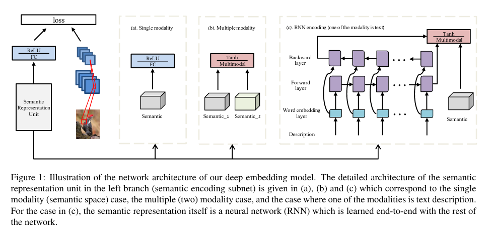

# Learning a Deep Embedding Model for Zero-Shot Learning (CVPR 2017)

## Introdução

* Os **modelos de ZSL** baseiam-se na a**prendizagem de um espaço de *embeddings* comum** onde a **descrição semântica** das classes e a **representação visual das imagens** podem ser **projetadas para a pesquisa pelo vizinho mais próximo** (*kNN*).
* A chave para os *deep models ZSL* de sucesso é a escolha do espaço das *embeddings* adequado. É argumentado que se deve usar o espaço das *features* das imagens, ao invés do espaço semântico, como espaço de projeção, uma vez que o problema de *hubness*[^1] será mitigado e a pesquisa pelo protótipo de classe mais próximo será mais eficiente.
* Os espaços semânticos mais usados em todos os trabalhos na área de ZSL são os espaços semânticos baseados em atributos semânticos que representam uma determinada classe, também chamados de protótipos de classe.

Tendo o espaço semântico e as *features* que representam uma images, o ZSL é resolvido em 2 passos:

1. É aprendido um espaço de *embeddings* comum onde os protótipos das classes e as *features* das imagens são projetadas;
2. A pesquisa pelo vizinho mais próximo é desencadeada nesse espaço para encontrar o protótipo de classe que melhor classifica a imagem.

* Neste paper, o foco está na aprendizagem completa de um modelo ZSL baseado em *embeddings* profundas, que oferece um enorme conjunto de vantagens,
* O problema dos espaços das *embeddings* é que são *high dimensional* e a pesquisa pelo vizinho mais próximo é executada lá, o que leva a que o *hubness problem* seja inevitável.
* Usar o espaço semântico como o espaço das *embeddings* irá diminuir a variância dos dados projetados, agravando, por isso, o *hubness problem*.

O modelo DNN baseado em *embeddings* para ZSL difere dos modelos existentes em:

1. O espaço das *features* é usado para como *embedding space*, ou seja, a direção da projeção é S $\rightarrow$ F, para mitigar o *hubness problem*;
2. É desenvolvido um método de fusão multimodal eficiente na NN que permite a aprendizagem completa das representações do espaço semântico.

## Related work

* Tem sido demonstrado que o espaço de atributos é mais eficaz do que um espaço de *word vectors*.
* Contudo, os *word vectors* acabam por ser mais rentáveis, na medida em que não é necessária anotação manual, feita por humanos.
* Os métodos existentes diferem no modelo *visual-semantic embedding* usado, e podem ser categorizados em dois grupos:
  * Métodos que aprendem uma função de projeção por regressão do espaço das *features* para o espaço semântico;
  * Métodos que aprendem um relacionamento entre os espaços visual e semântico através de uma camada intermédia comum (ESZSL).

## Modelo

A arquitetura do modelo é a ilustrado na figura seguinte:

Dado o conjunto de treino $D_{tr} = \{(I_i, y_i^u, t_i^u), i =1...N\}$, onde $I_i$ é a i-th imagem de treino, $y_i^u \in \Reals^{L \times 1}$ o vetor da representação semântica da classe respetiva e $t_i^u$ a *label* da classe.

A arquitetura do modelo é composta por dois ramos: (1) um ramo é o responsável pela extração de caraterísticas das imagens (CNN), onde a imagem $I_i$ é o *input* e o *output* é vetor de *features* $\phi(I_ i) \in \Reals^{D \times 1}$ $D$-dimensional. O espaço $D$-dimensional das *features* vai ser o espaço usado como *enbedding space* onde as imagens e as representações das respetivas classes irão ser projetadas e (2) o outro ramo é o responsável por obter as *embeddings* semânticas das classes, i.e., tem como *input* um vetor da representação semântica de $y_ i^u$ $L$-dimensional e após passar por duas camadas (FC) linear + ReLU devolve um vetor semântico $D$-dimensional.

Cada **camada FC é normalizada** com a **norma L2**.

Os dois ramos estão ligados por uma *least square embedding loss* que tem por objetivo minimizar a discrepância entre a *feature* $\phi(I_i)$ e o vetor da representação da classe correspondente no espaço visual (*features*).

A função objetivo toma a forma de:

$$
L(W_1, W_2) = \frac{1}{N} \sum_{i=1}^{N} \left \|\phi(I_i) - f_1(W_2 f_1 (W_1 y_i^u)) \right \|^2 + \lambda(\left \| W_1 \right \|^2 + \left \| W_2 \right \|^2)
$$

onde $W_1 \in \Reals^{L \times M}$ são os pesos a ser aprendidos na primeira camada FC e $W_2 \in \Reals^{M \times D}$ são os pesos a ser aprendidos na segunda camada FC. $\lambda$ é um hiperparametro e $f_1(.)$ é a função ReLU, que introduz não-linearidade no subrede de codificação.

A classificação de uma imagem de teste $I_j$ no espaço das *features* visuais é conseguida calculando a distância entre a sua representação e as restantes representações das classes presentes no espaço das *features*:

$$
v = \argmin_v D(\phi(I_j), f_1(W_2f_1(W_1 y^v)))
$$

onde $D$ é uma função de distância (e.g. cosine) e $y^v$ é o vetor do espaço semântico do $v$-ésimo protótipo de classe.

Até agora foi considerado apenas um único espaço semântico, tal como ilustrado na Fig. 1(a). No caso de serem usados mais do que um espaços semânticos, é feita a fusão de ambos os espaços Fig. 1(b). Mais concretamente, são mapeados os vetores das representações semânticas (atributos e word vectors) para uma camada de fusão multimodal onde são adicionados. O output da representação semântica será:

$$
f_2(W_1^{(1)} \cdot y_i^{u_1} + W_1^{(2)} \cdot y_i^{u_2})
$$

onde $y_i^{u_1} \in \Reals^{L_1 \times 1}$ e $y_i^{u_2} \in \Reals^{L_2 \times 1}$ são dois vetores diferente de representações semânticas e $W_1^{(1)} \in \Reals^{L_1 \times M}$ e $W_1^{(2)} \in \Reals^{L_2 \times M}$ são os pesos a serem aprendidos. $f_2(.)$ é a *element-wise scaled hyperbolic tangent function*:

$$
f_2(x) = 1.7159 \cdot   \tanh(\frac{2}{3}x)
$$

Esta função permite um processo de treino muito mais rápido do que a função tangente hiperbólica normal.

Quando estão disponíveis descrições textuais (frases) para cada imagem, usa-se uma RNN para codificar o conteúdo da frase num vetor semântico de tamanho fixo.

## Experiências

* **Datasets**:
  * **AwA**
  * **CUN-200-2011**
  * **ImageNet 2010 1K**
  * **ImageNet 2012/2010** (training: ImageNet 2012 / teste: 360 classes do ImageNet 2010)

* **Espaços semânticos**:
  * [AwA]: atributos contínuos de 85-D / word vectors de 1000-D
  * [CUB]: atributos *per-class* de 312-D / 10 descrições textuais *per-image*
  * [ILSVRC 2010 e ILSVRC 2012]: word vectors de 1000-D extraídos de um corpus de 4.6M de documentos da Wikipedia.

* Foi usado o modelo **Inception-V2** para extrair caraterísticas de 1024-D.

#### Parameter settings

No ramo semântico da rede, o tamanho de *output* da primeira camada FC foi definido para 300 para o AwA e 700 para o CUB, quando um único espaço semântico é usado.

No caso de fusão de espaços, o tamanho de *output* foi definido para 900.

No caso das descrições textuais, foi implementada uma LSTM bidirecional, usando o método `BasicLSTMCell`do *Tensorflow* como RNN cell e foi usada a ReLU como função de ativação. O tamanho de input foi definido a 30, o tamanho da word embedding e o número de unidades LSTM é 512. Foi usado RSMprop, lr = 0.0001 e um mini-batch de 64.

#### Resultados (%)

* O modelo foi testado considerando como espaço das *embeddings* o espaço das *features* e os resultados demonstram que a performance é cerca de 26% melhor no caso do AwA, sublinhando então a importância da escolha deste espaço como espaço das *embeddings* com a vantagem adicional de minimizar o *hubness problem*.

SS |AwA | CUB | ILSVRC 2010 | ILSVRC 2012/2010 
| -- |:---:| :----: | :----------: | :----:|
**A** (V -> S) | 60.6 
**A/W(D)**| 86.7/78.8 | 58.3/53.5 |
**A+W/D)** | 88.1 | 59.0 |
**hit@5** | - | - | 60.7 | 25.7

* A seleção do espaço das *features* como espaço das *embeddings* é a chave para o sucesso dos modelos *deep* na tarefa do ZSL.
* Os word vector contêm menos informação do que os atributos.
* A fusão de ambos os espaços (atributos e word vectors) resultado numa performance melhor.

## Conclusão

* O modelo aprensentado usa o espaço das *features* da CNN como *embedding space*, uma vez que faz com que o *hubness problem* seja menor.
* O modelo oferece flexibilidade no sentido em que é possível adotar várias fontes de informação diferentes para representar cada classe (atributos, word vectors, descrições textuais), graças à multimodalidade do sistema.
* As experiências demonstraram que o modelo apresentado supera todos os métodos anteriores.

[^1]: **Hubness problem**: *As introduced by G. Dinu et al. [^2], in projection methods, when adopting the semantic space as projection space and regression as the projection function, after projecting feature space instances into the semantic space $T$, some prototypes are nearest neighbors of a large number of instances from different classes. These prototypes are referred to as “hubs”, and this phenomenonis referred to as “hubness”*.

[^2]: Georgiana Dinu, Angeliki Lazaridou, and Marco Baroni. 2015. Improving zero-shot learning by mitigating the hubnessproblem. InInternational Conference on Learning Representations Workshops (ICLR Workshops’15).