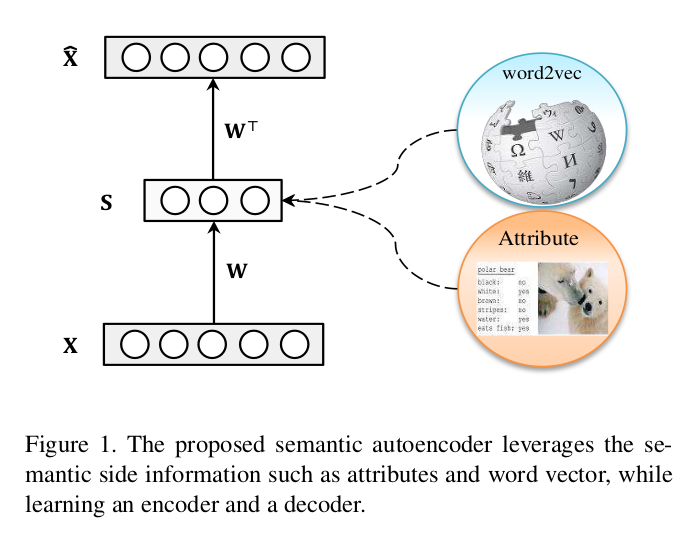

# Semantic Autoencoder for Zero-Shot Learning (CVPR 2017)

## Introdução

* Os métodos de ZSL existentes aprendem, tipicamente, uma função de projeção entre o espaço das *features* e o espaço das *embeddings* semânticas.
* Quando uma função de projeção é aplicada aos exemplos de teste, que no contexto do ZSL contêm classes disjuntas das classes de treino, o modelo ZSL cai no problema do ***domain shift***.
* Neste *paper* é proposta uma solução ZSL baseada na aprendizagem de um *Semantic Autoencoder* (SAE). O *encoder* é o responsável por projetar um vetor de *features* para o espaço semântico. O ***decoder*** vem incluir uma restrição adicional - a projeção deve ser **capaz de reconstruir a *feature* original**. Isto faz com que o modelo consiga **generalizar melhor para as classes desconhecidas**.
* O ***encoder*** e o ***decoder*** são modelos **lineares e simétricos**, o que faz com que o **algoritmo de aprendizagem** dos mesmos seja **eficiente** e de **custo computacional baixo**.
* Em *Machine Learning*, o problema do ZSL pode ser entendido, em linguagem corrente, como a capacidade de reconhecer objetos sem nunca ter visto exemplos visuais dos mesmos.
* O espaço das *embeddings* semânticas pode ser constituído por atributos o *word vectors*, que são os chamados protótipos de classe (*class prototypes*).
  
### O problema do *Domain Shift*

O problema do *domain-shift* foi identificado por Fu et al. [^1]. A ideia é que se a projeção das *features* semânticas é aprendida a partir das classes de treino (conhecidas), e quando essa projeção for aplicada às classes de teste (desconhecidas) pode acontecer que a projeção seja desfasada (*shifted*) devido ao bias das classes de treino. Por vezes este desfasamento pode ser tão grande que a procura pela classe que melhor classifica a instância de treino é completamente imprecisa.

O problema do *domain-shift* é resolvido com a restrição adicional do *decoder*:
* **Encoder**: projeção das *features* para o espaço semântico;
* **Decoder**: reconstrução das representações originais das *features*.

[^1]: [Transductive Multi-view Zero-Shot Learning](https://arxiv.org/pdf/1501.04560.pdf)

## Key points

* A velocidade computacional é essencial para testar um modelo ZSL aplicado a tarefas de reconhecimento em datasets de grande escala;
* A escalabilidade é tipicamente a motivação, tal que a anotação manual de atributos deixa de ser necessária e as classes passam a ser representadas por *word-vectors*.

## Projeção *Features* $\rightarrow$ *Semantic*

* Os modelos ZSL existentes distinguem-se pela forma como fazem a projeção das *features*, e podem ser divididos em três grupos:
  1. Métodos que aprendem uma função de projeção usando regressão ou modelos de *ranking*;
  2. Métodos que escolhem a direção de projeção reversa, i.e., semantic $\rightarrow$ visual;
  3. Métodos que aprendem um espaço intermédio onde são projetadas as *features* e as representações semânticas.

## Modelo



* O modelo aprensentado é um autoencoder *undercomplete*, uma vez que um espaço semântico, tipicamente, tem uma dimensão inferior ao espaço das *features*. O *encoder* funciona como uma CNN e o *decoder* com uma D(econvolutional)CNN.

* O *encoder* faz a projeção de um dado input para uma camada escondida que tem uma dimensão inferior e o *decoder* projeta novamente a projeção aprendida para o espaço das *features*, reconstruindo a *feature* original.

Dada uma matriz $X \in \Reals^{d \times N}$ composta por $N$ vetores de *features*, é projetada para um espaço latente de $k$-dimensões através da matriz de projeção $W \in \Reals^{k \times d}$, resultando numa representação lantente $S \in \Reals^{k \times N}$. A representação latente é projetada novamente para o espaço das *features* através da matriz de projeção $W^* \in \Reals^{d \times k}$ e o resultante é $\hat{X} \in \reals^{d \times N}$.

Resumindo:
 * Encoder: $XW = S$ 
 * Decoder: $SW^* = \hat{X}$

E $\hat{X}$ é tão similar quanto possível a $X$, logo a função objetivo é definida por:

$$
\min_{W, W*} \left \|X-W^*WX \right\|_{F}^{2} \; \; s.t. \; \; WX=S
$$

Para simplificar o modelo, vamos considerar "*tied weights*" (os pesos do decoder são a matriz transposta dos pesos do encoder): $W^* = W^T$

$$
\min_{W} \left \|X-W^TS \right\|_{F}^{2} \; \; s.t. \; \; WX=S
$$

Contudo, resolver uma função objetivo com uma restrição tal que $WX = S$ é difícil, logo a equação passa a ser escrita:

$$
\min_{W} \left \|X-W^TS \right\|_{F}^{2} + \lambda \left \|WX - S \right \|_{F}^{2}
$$

onde $\lambda$ é um coeficiente que controla a importância do primeiro e segundo termos da equação, que correspondem às losses do decoder e do encoder, respetivamente.

Para otimizar o modelo, faz-se a derivada da equação anterior. Usando as propriedades *trace* da Algebra Linear, $Tr(X) = Tr(X^T)$ e $Tr(W^TS) = Tr(S^TW)$ e de modo a aprender apenas a matriz $W$, vem:

$$
\min_{W} \left \|X^T-WS^T \right\|_{F}^{2} + \lambda \left \|WX - S \right \|_{F}^{2}
$$

A derivada da equação é:

$$
-S(X^T-S^TW) + \lambda(WX-S)X^T = 0
$$

$$
-SS^TW + \lambda WXX^T = SX^T + \lambda SX^T
$$

Se $A = SS^T$,  $B = \lambda XX^T$ e $C = (1 + \lambda)SX^T$, vem:

$$
AW + BW = C
$$

que é a formulação da equação de *Sylvester*[^2] e pode ser resolvida pelo algoritmo de *Bartels-Stewart*.

[^2]: [Sylvester equation](https://en.wikipedia.org/wiki/Sylvester_equation)

Em Python fica `scipy.linalg.solve_sylvester(A,B,C)`

**Algoritmo 1:**

```python
def sae(X,S,lambda):
"""
SAE - Semantic Autoencoder

Arguments:
X --- d x N data matrix
S --- k x N semantic matrix
lambda --- regularization parameter

Returns:
W --- k x d projection function
"""

A = S*S.T
B = lambda*X*X.T
C = (1 + lambda)*S*X.T
W = scipy.linalg.solve_sylvester(A,B,C)

return W
```

## Classificação

* **Notação**:
  * $Y$: classes conhecidas
  * $Z$: classes desconhecidas
  * $S_Y$: representações semânticas das classes conhecidas
  * $S_Z$: representações semânticas das classes desconhecidas
  * $X_Y$: conjunto de treino com $N$ exemplos: $\{(x_i,y_i,s_i)\}$

O objetivo é aprender um classificador tal que $f: X_Z \rightarrow Z$

### **SAE**

Dado o conjunto $S$ e $X_Y$, primeiramente são aprendidas as matrizes $W$ e $W^T$ pelo Algoritmo 1.


De seguida, a classificação ZSL pode ser executada em dois espaços:

#### 1) **Encoder**

Com a matriz $W$, podemos projetar o exemplo $x_i$ para o espaço semântico através da expressão: $\hat{s}_i = Wx_i$.

A classficação pode ser depois conseguida calculando a distância entre a representação semântica estimada $\hat{s}_i$ e os protótipos de classe $S_Z$:

$$
\Phi(x_i) = \argmin_j D(\hat{s}_i, S_{Z_j})
$$

onde $D$ representa uma função que mede a distância e $\Phi(.)$ devolve a classe prevista para o exemplo $x_i$.

#### 2) **Decoder**

Com a matriz $W^T$, podemos projetar os protótipos de classe $s_i$ para o espaço das *features* através da expressão: $\hat{x}_i = W^Ts_i$.

A classficação pode ser depois conseguida calculando a distância entre a representação da *feature* $x_i$ e os protótipos projetados $\hat{X}_Z$:

$$
\Phi(x_i) = \argmin_j D(x_i, \hat{X}_{Z_j})
$$

onde $D$ representa uma função que mede a distância e $\Phi(.)$ devolve a classe prevista para o exemplo $x_i$.

## Experiências

**Datasets**

Dataset | Semantic space / Dim | #seen/unseen classes | Acc (%) - $SAE(W)/SAE(W^T)$
:------: | :-----------------: | :-----------: | :-----------:
**AwA** | Atributos / 85 | 40/10 | $84.7 / 84.0$
**CUB** | Atributos / 312 | 150/50 | $61.4 / 60.9$
**aP&Y** | Atributos / 64 | 20/12 | $55.4 / 54.8$
**SUN** | Atributos / 102 | 645/72 - 707/10 | $65.2 / 65.2$ - $91.0 / 91.5$
**ImNet-1*** | Word vectors / 1000 | 800/200 | $46.1 / 45.4$
**ImNet-2**** | Word vectors / 1000 | 1000/360 | $26.3 / 27.2$

\* ILSVRC2010
\** ILSVRC2012/ILSVRC2010 (360 classes não incluídas no ILSVRC2012)

* Os ***word vectors*** são do tipo **word2vec**;
* As ***features* das imagens** foram extraídas pela **GoogLeNet (1024-dim)**, para os datasets de escala menor e pela **AlexNet (4096-dim)** para o caso do ImageNet; 
* O coeficiente $\lambda$ foi definido através de *cross-validation*;

**Métricas**

* **Top-1 accuracy** para os todos os datasets excepto o ImNet-1 e ImNet-2;
* **flat hit@K** para os datasets do ImageNet, em que o "**hit@K**" significa que a imagem de teste é classificada como "correta" se estiver nas **K** top *labels*. Foi reportada a hit@5 accuracy.


O modelo **SAE** foi comparado a 14 modelos ZSL SoA, no caso dos *small-scale datasets* e a 7 modelos ZSL no caso dos *large-scale datasets*.

O SAE supera todos os modelos, em todos os *datasets*.


O ***encoder*** SAE(W) é aquele que revela melhor performance.

A forte componente associado ao modelo reside na restrição de reconstrução presente no autoencoder.

### Generalized ZSL

* O conjunto de teste contém exemplos de classes conhecidas e desconhecidas;
* A métrica de avaliação usada foi a *Area Under Seen-Unseen accuracy Curve* (AUSUC), que mede o quão bem o modelo de ZSL consegue optar entre reconhecer exemplos de classes conhecidas e desconhecidas.

**Custo computacional**

O SAE revela-se um modelo até 10x mais rápido quando comparado com modelos do mesmo segmento.
* Treino: 1.3 segundos;
* Teste: 0.07 segundos;

## Conclusão

* O modelo SAE usa uma função de projeção linear simples e de rápida computação e é introduzida uma função objetivo de reconstrução adicional para aprender uma função de projeção mais generalizável.